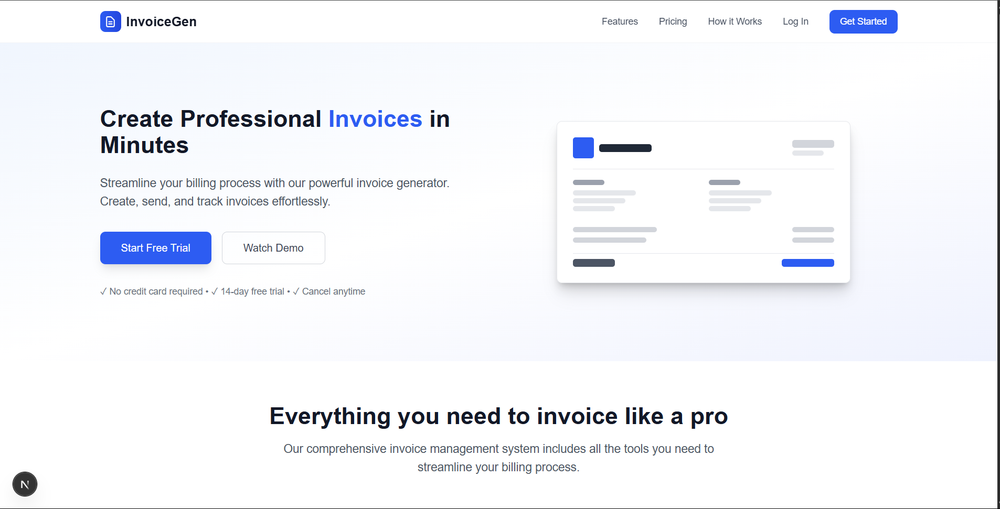
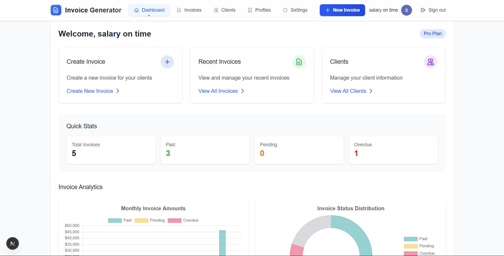
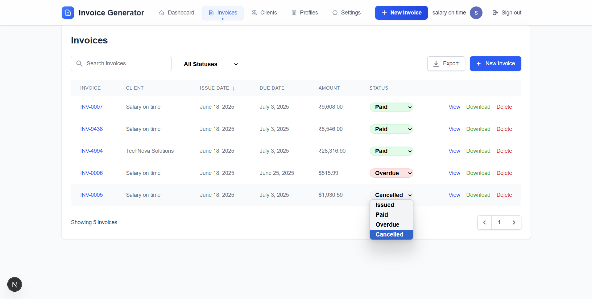
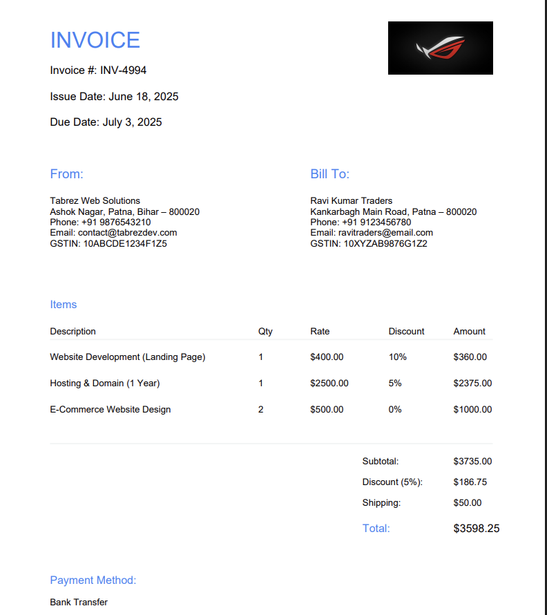

# InvoiceGen - Professional Invoice Generator

  <h1>InvoiceGen</h1>
  <h3>Professional Invoicing Solution for Businesses</h3>

## ⚠️ IMPORTANT LEGAL NOTICE

**© 2023-2024 InvoiceGen. All Rights Reserved.**

This software is proprietary and confidential. Unauthorized copying, modification, distribution, or use of this software, via any medium, is strictly prohibited without express written permission from the owner.

**This repository is made public for demonstration and portfolio purposes only.**

## 🚀 About InvoiceGen

InvoiceGen is a professional invoicing platform designed to help businesses create, manage, and track invoices efficiently. Built with Next.js, MongoDB, and Stripe integration, it offers a complete solution for business billing needs.

### Key Features

- **Professional Invoice Creation**: Create beautiful, customizable invoices
- **Client Management**: Organize and manage your client information
- **Business Profile Management**: Maintain multiple business profiles
- **Dashboard Analytics**: Track invoice status, payments, and business performance
- **Payment Integration**: Accept online payments via Stripe
- **Multiple Currency Support**: Work with various currencies including USD, EUR, GBP, INR, etc.
- **PDF Generation**: Download and share professional PDF invoices
- **Subscription Plans**: Free and premium plans with advanced features

## 🔧 Technology Stack

- **Frontend**: Next.js, React, TailwindCSS
- **Backend**: Next.js API Routes
- **Database**: MongoDB
- **Authentication**: NextAuth.js with Google OAuth
- **Payment Processing**: Stripe
- **PDF Generation**: jsPDF
- **Charts & Analytics**: Chart.js

## 📸 Screenshots

### Landing Page

*Professional landing page showcasing the invoice generator features*

### Dashboard

*User dashboard with invoice statistics and quick actions*

### Invoice Management

*Manage all your invoices with powerful filtering and sorting options*

### Invoice Preview

*Preview invoices before sending them to clients*

## 📝 License

This project is protected by copyright law. All rights reserved. For inquiries regarding licensing or commercial use, please contact the repository owner.

## 📞 Contact

For business inquiries, support, or more information:

- **Website**: [tabrezrabbani.in](https://tabrezrabbani.in)
- **Email**: tabrezrabbani750@gmail.com

---

  
Developed with ❤️ by Tabrez Rabbani

  
© 2023-2024 InvoiceGen. All Rights Reserved.

 